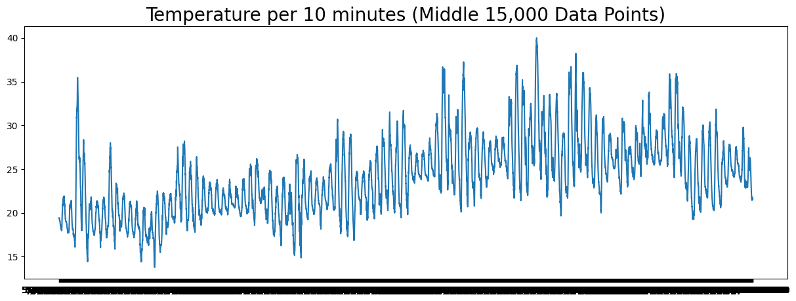
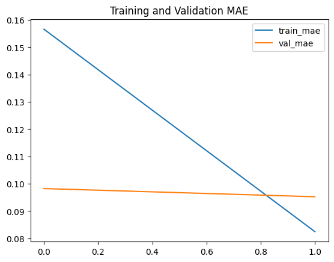

# 🌡️ Temperature Forecasting for Tetouan City

## 📊 Dataset
This project uses the [Power Consumption of Tetouan city](https://archive.ics.uci.edu/dataset/849/power+consumption+of+tetouan+city) dataset from the UC Irvine Machine Learning Repository.

## 🎯 Project Goal
The goal of this project is to forecast temperature in Tetouan city using historical data and deep learning techniques.

## 🛠️ Technologies Used
- Python
- Pandas
- NumPy
- TensorFlow
- Matplotlib
- Scikit-learn

## 🔍 Data Exploration
- The dataset contains 52,416 data points.
- Features include DateTime, Temperature, Humidity, Wind Speed, and Power Consumption for different zones.
- No missing values were found in the dataset.

## 🧮 Data Preprocessing
- Temperature data is extracted and scaled to a range between -1 and 1 using MinMaxScaler.
- Data is split into training (80%) and testing (20%) sets.
- A windowed dataset is created for time series forecasting.



## 🧠 Model Architecture
The model uses a Bidirectional LSTM architecture:
```python
model = tf.keras.models.Sequential([
    tf.keras.layers.Bidirectional(tf.keras.layers.LSTM(256, return_sequences=True), input_shape=(256, 1)),
    tf.keras.layers.Bidirectional(tf.keras.layers.LSTM(256)),
    tf.keras.layers.Dense(128, activation='relu'),
    tf.keras.layers.Dropout(0.3),
    tf.keras.layers.Dense(64, activation='relu'),
    tf.keras.layers.Dense(32, activation='relu'),
    tf.keras.layers.Dense(1)
])
```

## 🎛️ Model Training
- The model is trained using the Huber loss function and Adam optimizer with a learning rate schedule.
- Custom callbacks are implemented:
  - ModelCheckpoint: Saves the best model based on MAE.
  - EarlyStopping: Stops training if no improvement is seen after 5 epochs.
  - MAEThresholdCallback: Stops training if MAE is below 10% of the data range.

## 📈 Results
The model achieves a Mean Absolute Error (MAE) below the set threshold of 10% of the data range, making it acceptable for temperature forecasting.

 

## 🚀 Usage
1. Clone the repository
2. Install required libraries: `pip install pandas numpy tensorflow matplotlib scikit-learn`
3. Run the Jupyter notebook or Python script

## 🔮 Future Improvements
- Experiment with different model architectures
- Incorporate additional features like humidity and wind speed
- Implement hyperparameter tuning

## 📚 References
1. [UC Irvine Machine Learning Repository](https://archive.ics.uci.edu/)
2. [TensorFlow Documentation](https://www.tensorflow.org/api_docs)
3. [Scikit-learn Documentation](https://scikit-learn.org/stable/documentation.html)

---

If you find this project helpful, please give it a star! ⭐

Best regards, <br>
Krisna Santosa